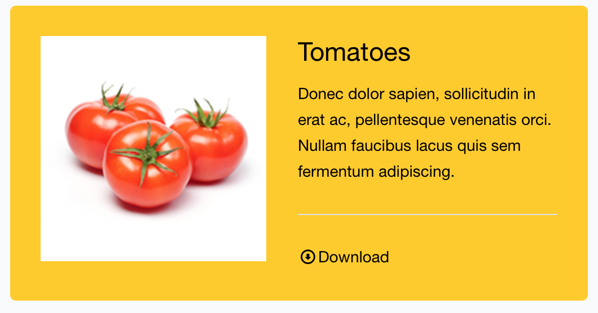
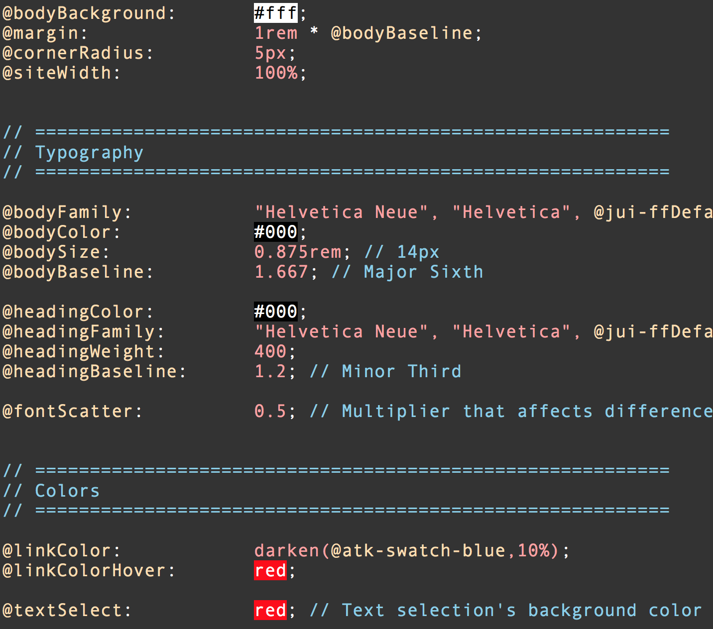
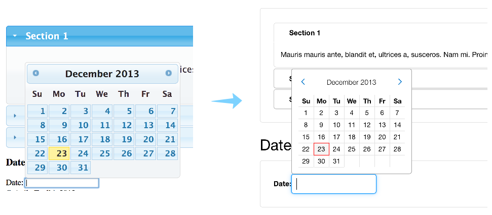

# AgileToolkit CSS 

Flexible and extensible User Interface framework for simple, consistent, aesthetic and modern website development.

**!! AgileToolkit CSS is in the early BETA stage. You may use at your own risk. !!**

## Table of contents

 - [Design philosophy and features]()
 - [Themes and Examples]()
 - [Quick start](#quick-start)
 - [Known Bugs and feature Request](#bugs-and-feature-requests)
 - [Documentation](#documentation)
 - [Authors](#authors)
 - [Copyright and license](#copyright-and-license)

## Design philosophy and features

When a major design company creates a high-end product, design or interface, they invest immense amount of theory and knowledge to make a harmonic and consistent design. 

The rest of us are working on a limited budgets or maybe even lack knowledge of concepts such as "grid system", "golden ratio", "baseline", "color palettes".

We decided to create AgileToolkit CSS to make it super easy for designers and developers to create a great looking websites with minimum effort and knowledge.

### Widgets built with Componentns

AgileToolkit CSS uses a concept of Widgets and Components. Below is a widget example. Each class starting with "atk-" is what we call a component (atk-box, atk-jackscrew, etc) 

    

	    

		    
		

		

		    <h4>Tomatoes</h4>
			
Donec dolor sapien, sollicitudin in erat ac.

			

			<a href="#">Download</a>
		

	

	

[View full example](http://cdpn.io/KGBJx)

The HTML and classes are used to describe the structure of a widget and behavior of it's elements. Here are some of the components explained:

 - atk-cells - creates columns for interior content of a div
 - atk-cells-gutter-large - sets a "large" gutter
 - atk-box - defines a paddings and border shapes of a div
 - atk-swatch-yellow - picks a yellow color from default palette
 - atk-cell - used for flexible vertical columns
 - atk-valign-middle - defines vertical alignment of content
 - atk-jackscrew - expands cell to fill maximum width
 
My Combining a known and re-usable components a designer or a developer can create any User Interface Object and easily adjust the layout.

### Design in only one way - the right way

The previous example enables you to use round corners, paddings and layouts but it does not let you adjust individual paddings, corner radius, font sizes or color tones. The purpose of this limitation is to only enable "Theme Designer" to adjust those values through extensive LESS settings. 

Implied limitations and variety of components makes it possible to create interfaces in only one possible way: how the theme designer have intended. On other hand, it gives a freedom to create any content variations which will still be consistent with theme settings.

### Simple to configure and customize

We have made it our goal to keep number of "settings" to the minimum and we use a lot of math to dynamically calculate the rest of settings, colors and sizes. Our paddings and margins are based on a baseline. Colors palette is also calculated based on the set of base-colors and we use capabilities of LESS to adjust the rest of the classes accordingly.

The fonts are defined only once and we enforce consistency and best practices of web design.

### Flexible Layout System

Without reliance on JavaScript - AgileToolkit CSS makes it easy to build any page layout. It can be fixed width or fluid. You can create one or several headers, footers, sidebars and content areas. You can also create a minimalistic layouts with center-aligned content or dynamic layouts which adjust their structure appropriately based on size of viewport (device) or container (resizable dialog).

[Center-based Layout Example](http://codepen.io/romaninsh/pen/vgEyf)

### Integrated with jQuery UI, Gridpack and Fontello

AgileToolkit CSS is a great way how to make jQuery UI stylesheet look nicely and respect your overall site settings. The effect will apply to default jQuery UI widgets and also third party jQuery add-ons.

Additionally the default icons of jQuery UI will be replaced with a vector-shaped icons from fontello - much better quality icons which render crisp on retina displays. The rest of fontello icons are included too.

We bundle a flexible grid from [gridpack.com](http://gridpack.com/) which is one of the best responsive CSS Grid frameworks out there.

### How is it different to Bootstrap?

#### UI Elements

Bootstrap comes with a great amount of widgets. Adding a new widget however is difficult.

AgileToolkit CSS focuses on similarity for adding a new widget and making them consistent.

#### REMs vs Pixels

Bootstrap relies on Pixels to build sizes.

AgileToolkit CSS uses REMs and builds fonts and paddings proportionally.

#### Grid

Bootstrap has a flexible grid which changes abruptly as you resize your browser.

AgileToolkit CSS relies on 3rd party GridPack and uses flexible margin-based grid. The definition of a grid is more similar to Bootstrap v2. (span_2)

#### Forms

Because Agile Toolkit primarily targets interactive user interfaces, ability to have a flexible forms and grids are very important in Agile Toolkit and it offers higher diversity 

### AgileToolkit CSS and Agile Toolkit

Agile Toolkit CSS comes along with [Agile Toolkit PHP](http://agiletoolkit.org/) framework starting from version 4.3. This allows you to build your interface using PHP entirely and rely on standard widgets of Agile Toolkit.
 

